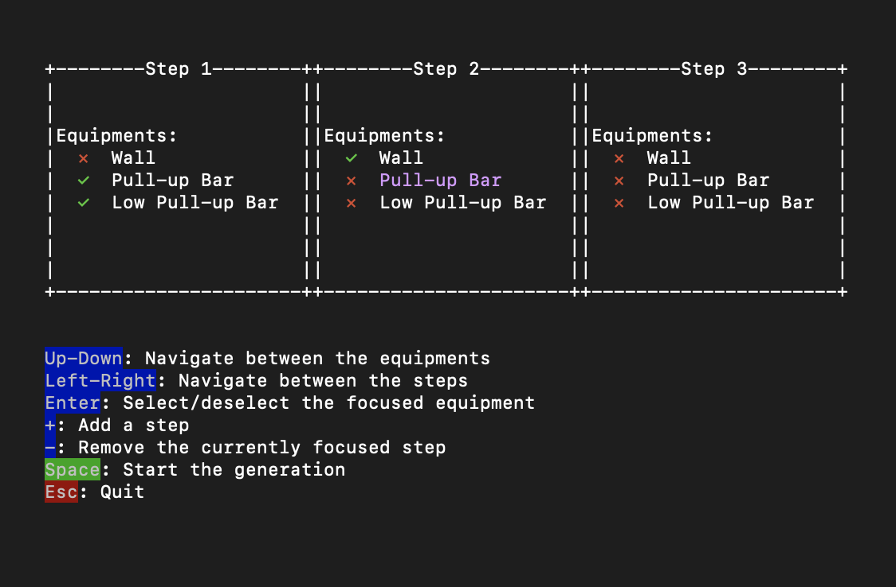

:portugal: [Versão portuguesa/Portuguese version](README.md)
***

# Major's Circuit Training [](https://github.com/TheLusitanianKing/MajorTraining/actions/workflows/tests.yml)

Inspired by the [circuit training of French Foreign Legion's Major Michiara](https://www.youtube.com/watch?v=wcitMZdgYIA), here is a very simple circuit training generator to plan yours with nothing but your terminal.



## Usage
```bash
cabal install
major
```

Check out the command line options with `major --help` if you want to.

## License
See [LICENSE](LICENSE) file.