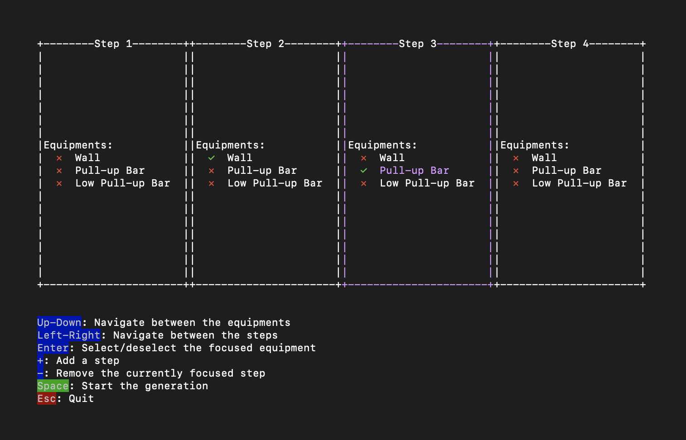

:portugal: [Versão portuguesa/Portuguese version](README.md)
***

# Major's Circuit Training 

Inspired by the [circuit training of French Foreign Legion's Major Michiara](https://www.youtube.com/watch?v=wcitMZdgYIA), here is a very simple circuit training generator to plan yours with nothing but your terminal.

## Usage
A simple `cabal run major` then you can follow the instructions. It should be clear enough what to do from there.

## License
See [LICENSE](LICENSE) file.